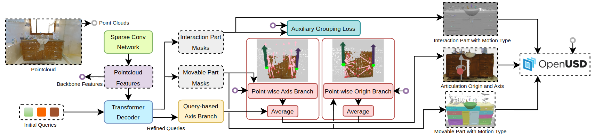

<!-- # USDNet -->
<div align='center'>
<h2 align="center"> USDNet </h2>
USDNet is the benchmark method of <a href="https://insait-institute.github.io/articulate3d.github.io/">Articulate3D</a>.  
Given a 3D indoor scene as input, USDNet identifies all movable parts and predict their interaction specifications.  
These include the part's motion characteristics—such as axis, origin, and motion type (rotation or translation)—as well as the specific graspable region that enables interaction (e.g., a door knob or window handle).  


</div>

## News :newspaper:
* **4. July 2025**: Code was made public.
* **25 June 2025**: Articulate3D accepted to ICCV 2025!

## Code Structure :clapper:
ToDo

### Dependencies :memo:
The project is based on the codebase of <a href="https://github.com/JonasSchult/Mask3D">Mask3D</a>.
You can set up the environment following <a href="https://github.com/JonasSchult/Mask3D">Mask3D</a>.

## Dataset Pre-processing :hammer:
ToDo

## Training :bullettrain_side:
ToDo

## Evaluation :vertical_traffic_light:
ToDo

## Benchmark :chart_with_upwards_trend:
ToDo

## BibTeX :pray:
```
@misc{articulate3d,
      title={Articulate3D: Holistic Understanding of 3D Scenes as Universal Scene Description}, 
      author={Anna-Maria Halacheva and Yang Miao and Jan-Nico Zaech and Xi Wang and Luc Van Gool and Danda Pani Paudel},
      year={2025},
      booktitle={International Conference on Computer Vision (ICCV)}
}
 ```